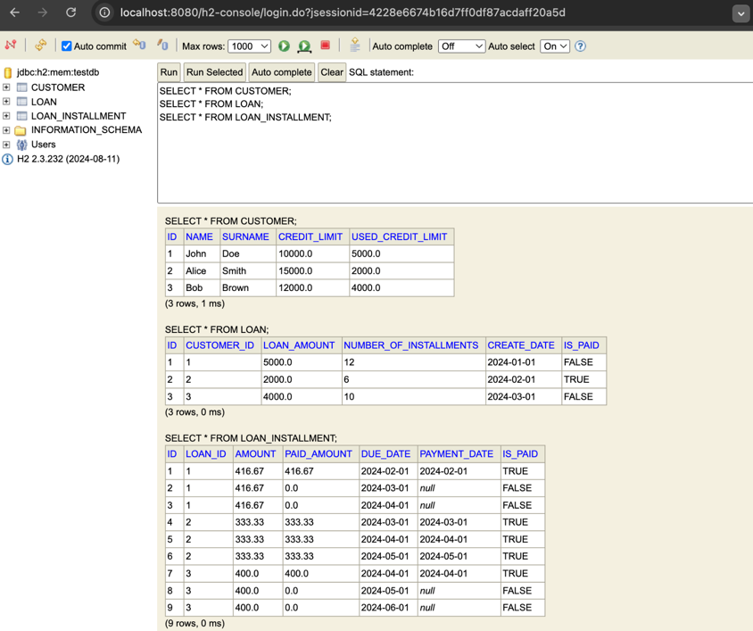

# Loan API Application

This is a Spring Boot-based backend application for managing loans, including creating loans, listing loans, paying installments, and more. The application uses an in-memory H2 database and follows a modular design with proper separation of entities, repositories, services, and controllers.

---

## Features

- **Create Loan**: Add a new loan for a customer with a fixed number of installments and interest rates.
- **List Loans**: Retrieve all loans associated with a specific customer.
- **List Installments**: Retrieve all installments for a specific loan.
- **Pay Loan**: Process installment payments for a loan, considering penalties for late payments and discounts for early payments.
- **Role-Based Access**: Admin users can manage all customers, while customers can only manage their own loans.

---

## Technologies Used

- **Java 17** 
- **Spring Boot 3.0+**
    - Spring Data JPA
    - Spring Web
    - Spring Security
- **H2 Database** (in-memory)
- **JUnit 5** (for testing)
- **Maven** (build tool)

---

## Prerequisites

- Java 17 (or later)
- Maven 3.8+
- An IDE like IntelliJ IDEA or Eclipse (optional)

---

## Getting Started

### Clone the Repository
```bash
git clone https://github.com/your-repo/loan-api.git //todo
cd loan-api
```

### Build and Run the Project
1. Build the project:
   ```bash
   mvn clean install
   ```
2. Run the application:
   ```bash
   mvn spring-boot:run
   ```
3. The application will be available at `http://localhost:8080`.

--------------------------------------------------------------------------------

### IMPORTANT NOTE ON HOW THE PROJECT WORKS:

## Swagger Implementation
When you run the application a login page will be appear, after you enter
credentials (sample username: admin, password: admin) you will be redirected
to swagger page of the api to test the api with sample request

## Data Preloading
The application uses a `data.sql` file to preload sample data into the database. 
You can modify this file in `src/main/resources` for your testing purposes.

--------------------------------------------------------------------------------

## Database Configuration

The application uses an in-memory H2 database. It is configured as follows:

- **Database URL**: `jdbc:h2:mem:testdb`
- **Username**: `sa`
- **Password**: (empty)
- H2 Console: `http://localhost:8080/h2-console`

#### H2 Console Login
- **JDBC URL**: `jdbc:h2:mem:testdb`
- **Username**: `sa`
- **Password**: (leave blank)

---

### Authentication User Info (defined in SecurityConfig)
**Admin User**
- Admin Username: `admin`
- Admin Password: `admin`

**Sample Users**
- Username: `john`
- Password: `john`

- Username: `bob`
- Password: `bob`

- Username: `alice`
- Password: `alice`


## Loan APIs

**Create Loan**

  - http://localhost:8080/swagger-ui/swagger-ui/index.html#/loan-controller/createLoan

  - Sample Request:

        {
        "customerId": 1,
        "loanAmount": 1200,
        "interestRate": 0.5,
        "numberOfInstallments": 6
        }
      
  - Sample Response:

        {
        "id": 4,
        "customer": {
        "id": 1,
        "name": "John",
        "surname": "Doe",
        "creditLimit": 10000,
        "usedCreditLimit": 6200
        },
        "loanAmount": 1200,
        "numberOfInstallments": 6,
        "createDate": "2024-12-26",
        "isPaid": false
        }


**Pay Loan**

  - http://localhost:8080/swagger-ui/swagger-ui/index.html#/loan-controller/payLoan

  - Sample Request:
        
          {
            "loanId": 1,
            "loanAmount": 1200
          }
        
  - Sample Response:
  
          {
            "installmentsPaid": 3,
            "totalSpent": 867.6,
            "loanPaidOff": false
          }

**List Loans By Customer**

  - http://localhost:8080/swagger-ui/swagger-ui/index.html#/loan-controller/getLoansByCustomer

  - Sample Request:

        {
          "customerId": 1,
          "paid": false
        }
      
  - Sample Response:

        [
          {
            "id": 1,
            "customer": {
            "id": 1,
            "name": "John",
            "surname": "Doe",
            "creditLimit": 10000,
            "usedCreditLimit": 6200
          }
        ]

**List Installments By Loan**

  - http://localhost:8080/swagger-ui/swagger-ui/index.html#/loan-controller/getInstallmentsByLoan

  - Sample Request:

        {
          "loanId": 1
        }
      
  - Sample Response:

        [
          {
            "id": 1,
            "loan": {
              "id": 1,
              "customer": {
                "id": 1,
                "name": "John",
                "surname": "Doe",
                "creditLimit": 10000,
                "usedCreditLimit": 6200
              },
              "loanAmount": 5000,
              "numberOfInstallments": 12,
              "createDate": "2024-01-01",
              "isPaid": false
            },
            "amount": 416.67,
            "paidAmount": 416.67,
            "dueDate": "2024-02-01",
            "paymentDate": "2024-02-01",
            "isPaid": true
          }, ... 
        ]


---

## Testing

### Run Tests
Execute the following command to run the unit tests:
```bash
mvn test
```

### Test Coverage
- Unit tests are written for services 

---

## Screenshots

**Swagger Implementation**


**Initial data defined on project initialization:**

